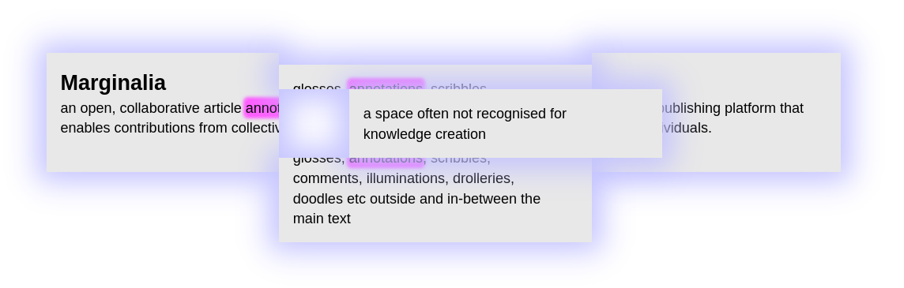

# Marginalia

*The flat-hierarchy annotation platform*



<p align="center">💫✨ <a href="https://margi-nalia.site"><b>LIVE DEMO</b></a> ✨💫</p>

Developed by Senka and Arran.

Support from [Stimulerings Fonds](https://www.stimuleringsfonds.nl/);

## To install and run

Requires [node.js](https://nodejs.org/), and [imagemagick](https://imagemagick.org/index.php) (for image conversion).
In a terminal run the following lines:

```bash
cd /somewhere/you/keep/projects/
git clone git@github.com:al165/MarginaliaDemo.git
cd MarginaliaDemo
npm install
npx webpack --config webpage.config.cjs
echo PORT=3000 >> .env
npm start
```

Then navigate to `localhost:3001` in your browser.

### Configuration

Create a file named `.env` in the root of the repo with the following content:

```properties
PORT=3001
BASE_URL=/
UPLOADS_DIR=./uploads

ADMIN_USERNAME=admin
ADMIN_PASSWORD=secret123
```

These are the default values.
The key/values are as follows:

- `PORT`: which port to listen on
- `BASE_URL`: is the root path of the URL, e.g. the api to get a room will become `<your_domain.com><BASE_URL>/<roomId>`. Must begin with a `/`, and if it ends in '/' it will be stripped.
- `UPLOADS_DIR`: the destination that uploaded images are saved to and served from. It will be created if it does not already exist. Note that there will also be a `tmp/` folder created in here that is used as a working directory when converting images.
- `ADMIN_USERNAME` and `ADMIN_PASSWORD`: credentials to access `/admin` for adminastrive tools. *Must be set!*
